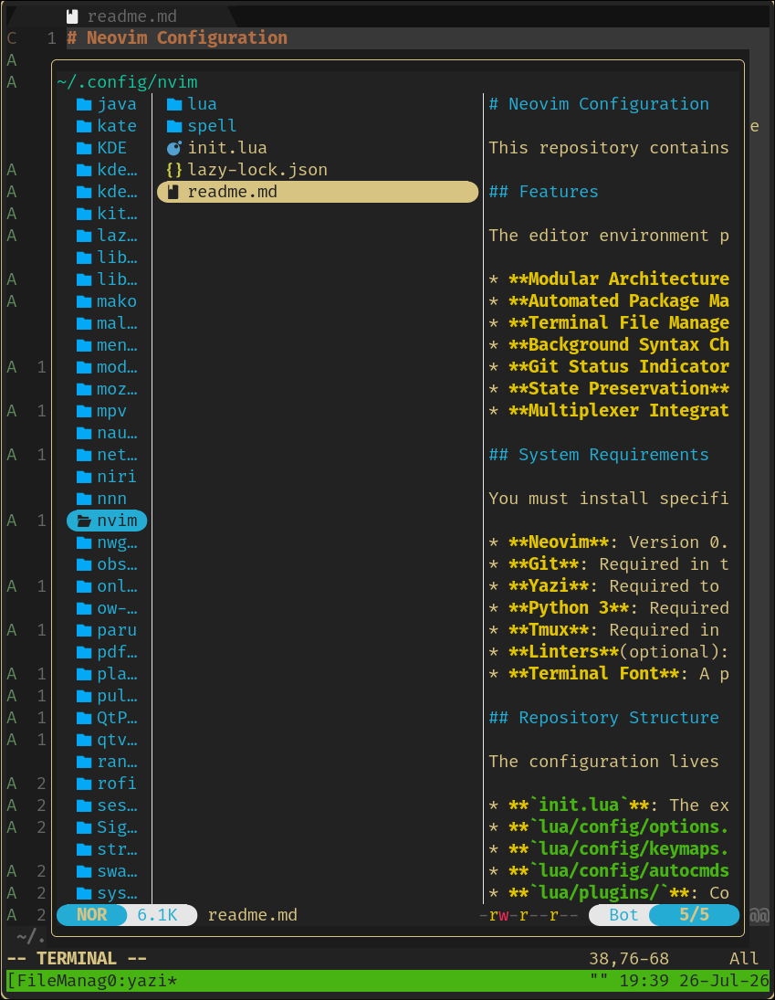
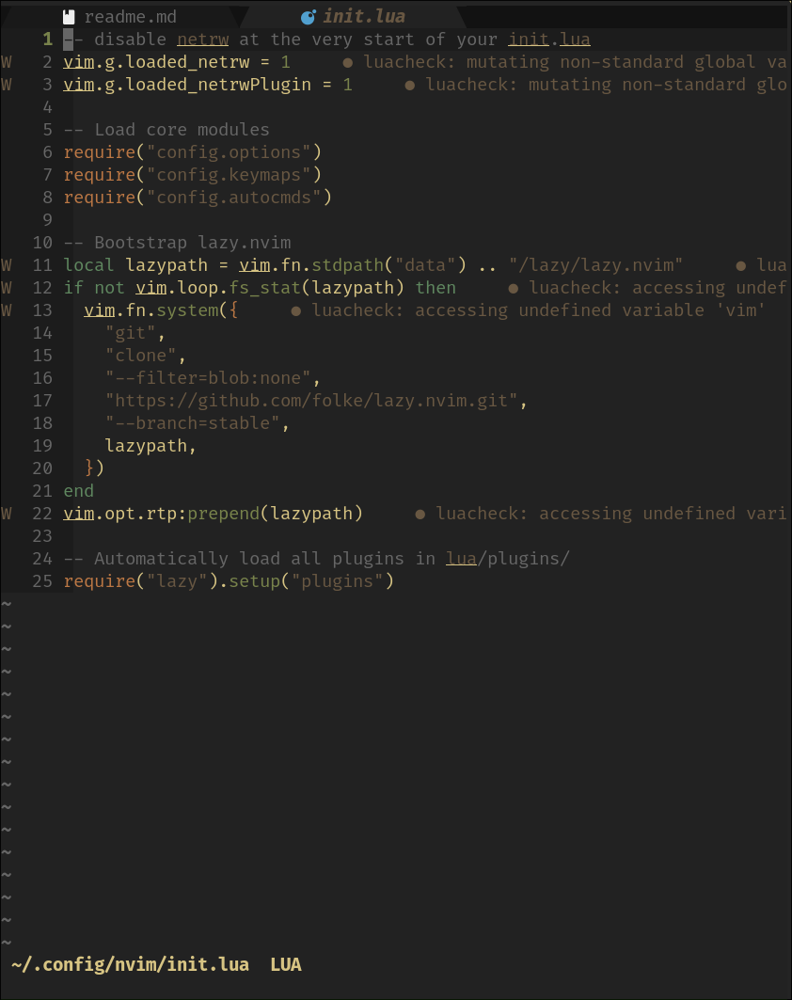

# Neovim Configuration

<p align="center">
  
  
</p>

This repository contains a modular Neovim setup managed by `lazy.nvim`. The architecture isolates core settings, automatic commands, and plugin specifications into distinct files. This prevents a single syntax error from breaking the entire editor launch sequence.

## Features

The editor environment provides specific functional capabilities managed through isolated configuration files.

* **Modular Architecture**: Configuration settings split into specific domains for options, keymaps, and automated commands. A syntax error in one file does not halt the parsing of the others.
* **Automated Package Management**: The `lazy.nvim` plugin handles all package installations and updates on editor launch.
* **Terminal File Management**: The Yazi file manager opens as an overlay directly above the active buffer.
* **Background Syntax Checking**: The `nvim-lint` package processes JavaScript, Python, Lua, and shell scripts automatically upon saving the file or exiting insert mode.
* **Git Status Indicators**: The `gitsigns` plugin maps repository additions, changes, and deletions to the sign column alongside line numbers.
* **State Preservation**: Neovim writes buffer changes to the disk automatically when window focus shifts or insert mode ends.
* **Multiplexer Integration**: Window movement commands execute identical directional shifts across Neovim splits and Tmux panes.

## System Requirements

You must install specific host dependencies for all editor functions to execute correctly.

* **Neovim**: Version 0.9.0 or newer.
* **Git**: Required in the system path to clone `lazy.nvim` and target repositories.
* **Yazi**: Required to execute the file manager overlay commands.
* **Python 3**: Required to use the `<F2>` buffer execution keymap.
* **Tmux**: Required in the host terminal to utilize the pane navigation features.
* **Linters**(optional): The system should have `eslint_d`, `flake8`, `luacheck`, and `shellcheck` installed to populate the diagnostic interface additional linters can be configured in the lint plugin file as needed.
* **Terminal Font**: A patched Nerd Font must be active in the host terminal emulator to render user interface icons.

## Repository Structure

The configuration lives inside `~/.config/nvim/` and relies on the standard Lua package path.

* **`init.lua`**: The execution entry point. It disables the native `netrw` file explorer, sources core editor files, and bootstraps the package manager.
* **`lua/config/options.lua`**: Defines native editor behaviour, including formatting rules, spell checking, and diagnostic interface elements.
* **`lua/config/keymaps.lua`**: Establishes global keyboard shortcuts, split window resizing, and normal mode overrides.
* **`lua/config/autocmds.lua`**: Controls automatic events for markdown detection, code folding, and dynamic cursor line visibility.
* **`lua/plugins/`**: Contains standalone files for each installed plugin. `lazy.nvim` reads this directory automatically on startup.

## Plugin Ecosystem

The editor relies on specific tools for navigation, version control, and visual feedback.

* **Package Management**: `lazy.nvim` handles asynchronous plugin loading and directory state.
* **Aesthetics**: The editor uses `miasma.nvim` for a dark background colour scheme. `bufferline.nvim` provides a tabbed interface for open files at the top of the screen.
* **File Navigation**: `yazi.nvim` replaces the native file explorer. It launches the Yazi terminal file manager directly over the current buffer.
* **Linting**: `nvim-lint` runs syntax checks in the background upon saving or leaving insert mode. It triggers `eslint_d` for JavaScript/TypeScript, `flake8` for Python, `luacheck` for Lua, and `shellcheck` for shell scripts.
* **Integration**: `gitsigns.nvim` adds git modification indicators (additions, deletions, changes) to the sign column. `vim-tmux-navigator` links Neovim and Tmux to use identical movement keys.
* **Formatting**: `vim-markdown` provides specific syntax highlighting and rules for markdown documents.

## Core Keybindings

The configuration utilizes standard modifier keys for custom commands.

| Keybinding | Action |
|---|---|
| `<F2>` | Save the file, clear the terminal, and run the buffer through Python 3 |
| `<C-h/j/k/l>` | Move across Neovim splits and external Tmux panes |
| `<Tab>` | Move to the next open file in the bufferline |
| `<leader>x` | Close the current buffer |
| `<C-f>` | Open Yazi at the current file location |
| `<C-Up/Down/Left/Right>` | Adjust the dimensions of the current split window |

## Installation and Backup

Neovim distributes its files across four separate locations to comply with the XDG Base Directory specification. Moving only the configuration folder leaves behind accumulated state and installed plugins that will collide with a new setup.

The `.bak` extension is a standard naming convention. Unix operating systems ignore file extensions when handling directories. Appending `.bak` to a folder only changes its text label. Neovim reads configuration data specifically from `~/.config/nvim` and state data from its specific XDG paths. Renaming these directories forces the editor to look for folders that no longer exist. The application then generates a completely empty environment on your next launch.

Run these exact commands in your terminal to isolate your previous setup safely:

```bash
mv ~/.config/nvim ~/.config/nvim.bak
mv ~/.local/share/nvim ~/.local/share/nvim.bak
mv ~/.local/state/nvim ~/.local/state/nvim.bak
mv ~/.cache/nvim ~/.cache/nvim.bak
```

After securing your old files, clone this repository into your configuration folder with the command

```bash
git clone https://github.com/Sal-Abu/sal-abu-neovim.git ~/.config/nvim
```

## Restoring the Previous Configuration
The backup process renames your original directories to prevent the editor from reading them. To reverse the process, you must delete the current environment and remove the .bak suffix from your saved folders.

Execute the following block to clear out the new configuration and reinstate your original files:

```bash
rm -rf ~/.config/nvim ~/.local/share/nvim ~/.local/state/nvim ~/.cache/nvim
mv ~/.config/nvim.bak ~/.config/nvim
mv ~/.local/share/nvim.bak ~/.local/share/nvim
mv ~/.local/state/nvim.bak ~/.local/state/nvim
mv ~/.cache/nvim.bak ~/.cache/nvim
```
